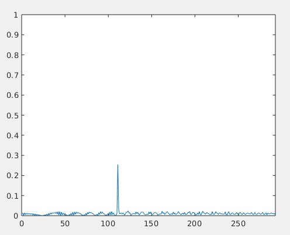
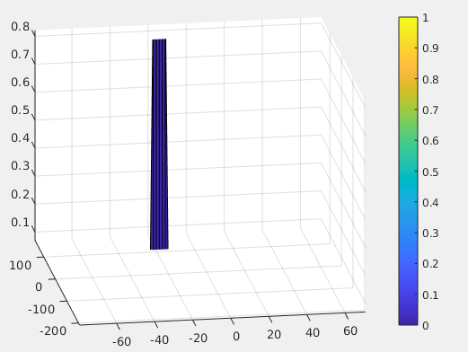

#SFND Radar target generation and detection

##Project layout

This is the final project of the radar course provided by Udacity and included in their sensor fusion course. The project is coded using Matlab. 

1. Configure the FMCW waveform based on the system requirements.
2. Define the range and velocity of target and simulate its displacement.
3. For the same simulation loop process the transmit and receive signal to determine the beat signal
4. Perform Range FFT on the received signal to determine the Range
5. Towards the end, perform the CFAR processing on the output of 2nd FFT to display the target.

##Radar System Requirements

System Requirements defines the design of a Radar. The sensor fusion design for different driving scenarios requires different system configurations from a Radar. In this project, you will designing a Radar based on the given system requirements (above).

Max Range and Range Resolution will be considered here for waveform design.

You will provide the initial range and velocity of the target. Range cannot exceed the max value of 200m and velocity can be any value in the range of -70 to + 70 m/s.

####Task 1 : FMCW Waveform Design

Using the given system requirements, design a FMCW waveform. Find its Bandwidth (B), chirp time (Tchirp) and slope of the chirp.

'''
Rmax = 200;
Range_resolution = 1;
Vmax = 70;
c = 3e8; %Speed of light in m/s

%Sweep/chirp time for each chirp is defined to be 5.5 times the round trip
%time for maximum range
Tchirp = 5.5 * 2 * (Rmax/c);

%Bandwidth for each chirp for given resolution
Bandwidth = c / (2*Range_resolution);

%The slope of the chirp 
Slope = Bandwidth/Tchirp;
'''

####Task 2 : Simulation Loop

Simulate Target movement and calculate the beat or mixed signal for every timestamp.

'''
for i=1:length(t)         
    
    r_t(i) = R + V * t(i);
    td(i) = 2 * r_t(i)/c;
    
    %For each time stamp update the Range of the Target for constant velocity. 
    
    %For each time sample we need update the transmitted and
    %received signal. 
    Tx(i) = cos(2*pi*(fc*t(i) + (Slope*t(i)^2)/2));
    Rx(i) = cos(2*pi*(fc*(t(i) - td(i)) + (Slope*(t(i) - td(i))^2)/2));
    
    %Now by mixing the Transmit and Receive generate the beat signal
    %This is done by element wise matrix multiplication of Transmit and
    %Receiver Signal
    Mix(i) = Tx(i).*Rx(i);
    
end
'''

####Task 3 : Range FFT (1st FFT)

Implement the Range FFT on the Beat or Mixed Signal and plot the result.

'''
%reshape the vector into Nr*Nd array. Nr and Nd here would also define the size of
%Range and Doppler FFT respectively.
Mix = reshape(Mix, [Nr,Nd]);

%run the FFT on the beat signal along the range bins dimension (Nr) and
%normalize.
Mix_fft = fft(Mix,Nr);
Mix_fft = Mix_fft./Nr;

% Take the absolute value of FFT output
Mix_fft = abs(Mix_fft);

% Output of FFT is double sided signal, but we are interested in only one side of the spectrum.
% Hence we throw out half of the samples.
single_Mix_fft = Mix_fft(1:Nr/2);

%plotting the range
figure ('Name','Range from First FFT')
plot(single_Mix_fft);
axis ([0 200 0 1]);

'''

####Task 4 : 2D CFAR

Implement the 2D CFAR process on the output of 2D FFT operation, i.e the Range Doppler Map.

- Slide Window through the complete Range Doppler Map

- Select the number of Training Cells in both the dimensions.

'''
Tr=10;
Td = 8;
'''

- Select the number of Guard Cells in both dimensions around the Cell under test (CUT) for accurate estimation

'''
Gr=4;
Gd=4;
'''

- Offset the threshold by SNR value in dB

'''
offset=20;
'''

- design a loop such that it slides the CUT across range doppler map by giving margins at the edges for Training and Guard Cells.
- For every iteration sum the signal level within all the training cells. 
- To sum convert the value from logarithmic to linear using db2pow function. 
- Average the summed values for all of the training cells used. 
- After averaging convert it back to logarithimic using pow2db.
- Further add the offset to it to determine the threshold. Next, compare the signal under CUT with this threshold. If the CUT level > threshold assign it a value of 1, else equate it to 0.

NB : Use RDM[x,y] as the matrix from the output of 2D FFT for implementing CFAR

'''
for i = Tr+Gr+1:(Nr/2)-(Gr+Tr)
    for j = Td+Gd+1:Nd-(Gd+Td)
        
        %Create a vector to store noise_level for each iteration on training cells
        noise_level = zeros(1,1);

        for p = i-(Tr+Gr):i+Tr+Gr
            for q = j-(Td+Gd):j+Td+Gd
                %Exclude the guard cells and CUT
                if (abs(i-p)>Gr || abs(j-q)>Gd)
                    noise_level = noise_level + db2pow(RDM(p,q));
                end
            end
        end
        %calculate the threshold from the noise average
        threshold = pow2db(noise_level/(2*(Td+Gd+1)*2*(Tr+Gr+1)-(Gr*Gd)-1));
        threshold = threshold + offset;
        
        CUT = RDM(i,j);
        if(CUT<threshold)
            RDM(i,j)=0;
        else
            RDM(i,j)=1;
        end
    end
end
'''

Result after suppressing the non-thresholded cells atthe edges :

The target is correctly detected at ~110m and 20m/s.

